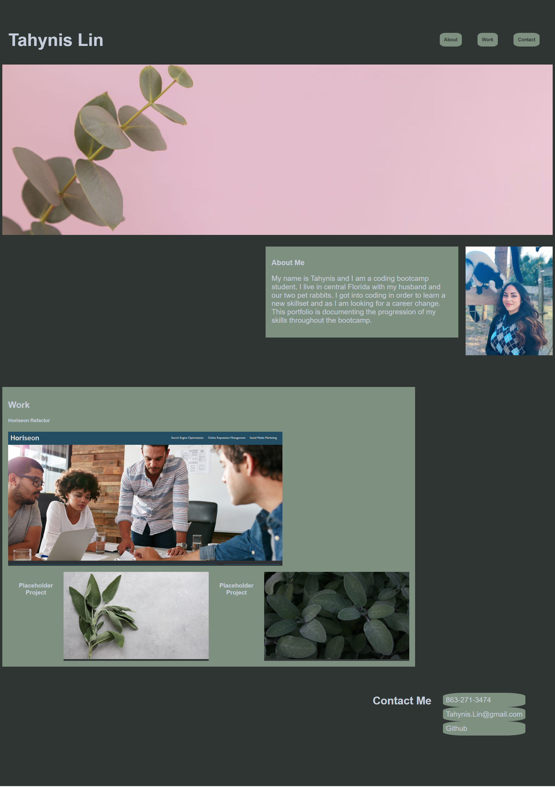

# professional-portfolio

## Description

- This project was to create a portfolio that I can build off of and add to throughout my time in this coding bootcamp. I think this project helped me understand some of the concepts we've learned so far a bit better. Page has a nav bar that when clicked will take user to selected section on page. I used the refactor from last challenge as main work, when image is clicked, user is taken to the site. Two placeholder images on the webpage.

## Deployed page

Link to deployed page.

## Credits
Went through various articles from W3 schools to help get me started with css, but these two helped me a lot with nav.
<ul>
    <li><a href="https://www.w3schools.com/howto/howto_js_topnav.asp">Top Navigation</a></li>
    <li><a href="https://www.w3schools.com/howto/howto_css_navbar_image.asp">Navbar image</a><li>

Placeholder images and nav bar image downloaded from <a href="https://unsplash.com">Unsplash</a>